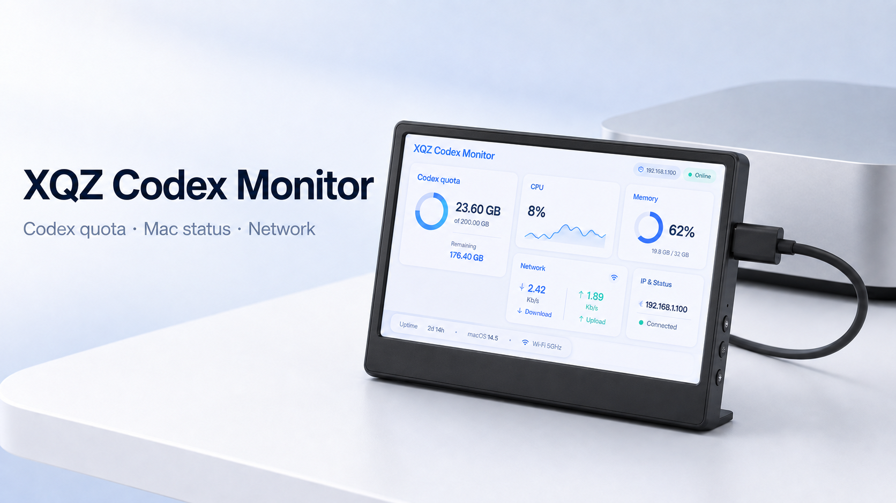

# XQZ Codex Monitor (Electron)

<p align="center">
  
</p>

<p align="center">
  
  
  
  
</p>

macOS 菜单栏小程序：通过 USB-C / DP 驱动 Sony XQZ-IV01 外接小屏，把仪表盘以 1280×720 白色卡片常驻显示在外接小屏上，主显示器不受影响。仪表盘支持三个页面切换：

- **Codex 额度**：5 小时额度、每周额度、近 14 天趋势、代码审查剩余、额度重置券、额外 Credits（数据来自 CodexBar 官方 CLI，不碰账号凭据）。
- **Mac 系统**：CPU 使用率、内存、磁盘、实时网速（近 2 分钟曲线）、负载、macOS 版本与运行时间。
- **网络 & IP**：外网 IP 与 ISP/归属地（ipify + ip-api.com）、本机 IPv4、网关、DNS、Wi-Fi SSID。

系统数据由 macOS 自带报告器采集（`os.cpus` / `vm_stat` / `fs.statfsSync` / `netstat -ib` / `route` / `scutil` / `networksetup`），无第三方依赖；温度传感器在 Apple Silicon 上需要 root 权限的 `powermetrics`，未集成。

> 亮度说明：XQZ 的物理亮度按键只改本机背光、不经过 USB（Sony 官方 UsbConnectionManager 协议仅 `show`/`stop`）；macOS 26 上 DDC/CI（ddcctl）因缺少 `com.apple.windowserver.plist` 无法工作。屏幕绝对亮度过高时请用设备实体亮度键调节。

- 独立的原生 USB helper（libusb）持续向 XQZ 发送 `show` 心跳；识别名为 `Moni Extende`/`XQZ` 或 16:9 非主屏的显示器并自动投屏。

## 连接与展示

XQZ-IV01 是 DP 直通屏：macOS 一旦枚举出它，仪表盘会自动全屏显示。要点：

1. 用**全功能/DP Alt Mode USB-C 线**把 Mac 接到 XQZ 的 INPUT 口；XQZ 开关拨到 ON。
2. 本 app 的 USB helper 会**每 320ms 向 XQZ 发一次 `show`**——这步是你的屏幕能被 macOS 认出来的关键（断开 helper 屏幕会消失）。
3. 识别成功后 macOS 会新增显示器 **Moni Extende 1280×720@60**，app 自动把仪表盘投过去并置顶。托盘可随时"显示到 XQZ / 主屏预览"。
4. **若主屏也被降到 720p/两块屏画面一样**：说明 macOS 把 XQZ 设成了镜像，去 系统设置 → 显示器 → 排列，取消勾选“镜像显示器”，让它变成独立扩展屏。

状态文案含义：
- `未检测到 XQZ · 请连接 USB-C` — helper 没找到 0x054C:0x0E48。
- `XQZ 已连线 · 准备画面` — USB 已握手、正在发 show，等 macOS 枚举显示器。
- `XQZ 已连接 · 显示中` — 显示器已找到，仪表盘已投屏。
- 托盘“诊断…”可一键查看 USB 设备、显示器列表、镜像状态与 helper 日志。

## 目录

- `helper/xqz-usb-helper.c` — USB 心跳程序（libusb，0x054c:0x0e48），独立编译成二进制。
- `main.js` — Electron 主进程：CodexBar CLI 轮询、helper 子进程、外接屏定位/置顶、托盘菜单。
- `preload.js` — contextBridge 暴露 `monitor.onUsage` / `monitor.onState`。
- `renderer/` — 仪表盘界面（白底卡片 + SVG 趋势图）。

## 运行

```bash
npm install          # 首次；本机缓存损坏时可用 npm install --cache <临时目录>
npm start            # 开发模式运行
```

## 打包成 .app

```bash
./build.sh           # 编译 helper + 组装 dist/XQZ Codex Monitor.app（250MB）
open "dist/XQZ Codex Monitor.app"
```

`build.sh` 直接复用 `node_modules/electron/dist/Electron.app` 手动组装 bundle（规避 electron-packager 在本机的 extract-zip 缺陷），并把 helper 打进 `Contents/Resources/helper/`，同时把 `LSUIElement` 置为 `true`（纯菜单栏应用）。需要 macOS 14+、Xcode Command Line Tools、Homebrew `libusb`，以及 `/Applications/CodexBar.app` 或 PATH 中的 `codexbar`。

## 说明

- 小屏用法：手机用全功能 DP USB-C 线连上 XQZ 后，这台 Mac 用另一根线接 XQZ；识别到外接屏后仪表盘自动全屏显示。`event:flip` 会镜像画面以适应屏幕方向。
- 托盘菜单支持：显示到 XQZ、主屏预览、刷新额度、退出。
- 验证：`npm start` 与打包版均冒烟测试通过；`node smoke.js`（通过 `electron smoke.js` 运行）可本地验证渲染逻辑。
- 本目录只涉及 Mac 端展示；U50S 手机端驱动/展示是独立工作，互不耦合。
